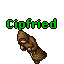

<p align="center">
  
</p>

<h1 align="center">Utevo Lux</h1>

<p align="center">Software skills inspired by Tibia. From the first conversation to the fixed PR.</p>

```text
hi → mission → equip → hunt → look → exura
                  bug ↗
```

 **[hi](plugins/utevo-lux/skills/hi/SKILL.md)** — Opens the dialog with the NPC: one decision at a time until the quest and the route are clear.

 **[mission](plugins/utevo-lux/skills/mission/SKILL.md)** — Takes the mission from the quest log: finds answers in code, history, and the web, with evidence.

 **[equip](plugins/utevo-lux/skills/equip/SKILL.md)** — Gears up for the hunt: steps, dependencies, acceptance criteria, and verifications before anyone attacks.

 **[hunt](plugins/utevo-lux/skills/hunt/SKILL.md)** — Attacks the code: executes the plan and loots the proof that it works.

 **[look](plugins/utevo-lux/skills/look/SKILL.md)** — Looks at the item a friend found: PR, issues, and discussions; points out demonstrable problems.

 **[exura](plugins/utevo-lux/skills/exura/SKILL.md)** — Heals the PR wounded on the hunt: one commit per change, with a reply at the source.

 **[bug](plugins/utevo-lux/skills/bug/SKILL.md)** — Tracks the bug to its lair and finds the root cause; slays it when asked or with `--fix`.

Use the step the work needs. The sequence is not mandatory.

Briefs, research, plans, progress, and reports stay **in the conversation**. The skills read existing documentation but do not create or update docs, wishlists, or feature records. They do not require a specific stack, ID system, MCP, or model.

## Install as skills — short names

In the project where you want to use the skills, with Node.js 22.20+ and Git available:

```sh
npx skills add lucasmonstrox/utevo-lux --agent claude-code codex cursor --skill '*'
```

The installer lets you choose the destination and method. To install in all your projects, add `--global`. To install for a single agent, keep only its name after `--agent`.

To pick one skill or check the catalog before installing:

```sh
npx skills add lucasmonstrox/utevo-lux --list
npx skills add lucasmonstrox/utevo-lux --agent codex --skill mission
```

In Claude Code and Cursor, use `/hi`, `/mission`, `/equip`, etc. In Codex, select the skill in the picker or mention `$hi`, `$mission`, `$equip`, etc. The invocation format belongs to the agent; the instructions are the same.

The installer is the [Vercel Skills CLI](https://github.com/vercel-labs/skills). Each skill ships with its references and can be installed separately.

## Install as a plugin from the marketplace

The **repository** is where the files live. The **plugin** is the package of the seven skills. The **marketplace** is the catalog that says where to find that package. No website or server is needed.

This repository provides the catalogs for the three agents, all pointing to the same package in `plugins/utevo-lux/`.

### Claude Code

Inside Claude Code:

```text
/plugin marketplace add lucasmonstrox/utevo-lux
/plugin install utevo-lux@utevo-lux
```

The first `utevo-lux` identifies the plugin; the second, the marketplace. Choose the install scope in the interface and reload plugins when prompted.

Plugins are namespaced in Claude: `/utevo-lux:hi`, `/utevo-lux:mission`, etc. To keep `/hi` and the other short names, use the direct skill install above. Avoid installing both forms in the same scope unless you want duplicate commands. [Official documentation](https://code.claude.com/docs/en/plugins)

### Codex

In the terminal, on a version with plugin support:

```sh
codex plugin marketplace add lucasmonstrox/utevo-lux
codex plugin add utevo-lux@utevo-lux
```

Open a new conversation and select the installed skill. The catalog lives in `.agents/plugins/marketplace.json`; the package manifest lives in `.codex-plugin/plugin.json`. [Plugins in Codex](https://learn.chatgpt.com/docs/build-plugins)

### Cursor

The direct install with `npx skills add` above makes the skills available in Cursor. To test the package as a local plugin, clone the repository and copy the **entire `plugins/utevo-lux` folder** to `~/.cursor/plugins/local/utevo-lux`, then reload the window and check Customize.

The `.cursor-plugin/marketplace.json` catalog prepares the repository for distribution as a plugin. Listing in Cursor's public store requires submission and review; having this repository does not mean it is listed there. [Official documentation](https://cursor.com/docs/plugins)

## Usage

```text
/hi I want to improve the sign-up flow
/mission Compare the options based on the brief above
/equip Plan the direction we chose
/hunt Execute the plan above
/bug The form submits twice --fix
/look https://github.com/owner/repo/pull/123
/exura https://github.com/owner/repo/pull/123
```

Adapt the prefix to your install mode. A new session needs to receive the previous plan/context: the skills do not generate memory files.

`look` delivers the review in the conversation; `--publish` or an explicit request authorizes publishing to the PR. Explicitly invoking `exura` includes fixing, testing, committing, pushing, and replying; `--local` prepares the commits and drafts without pushing or commenting. Each one respects the available authorizations and tools.

GitHub reviews need access through the connector or the `gh` CLI. External research needs search/web access. UI verification needs a real browser; unavailability is stated.

## Evidence

Each skill instructs an agent to work a certain way. Those instructions are claims about how a model behaves, and most of them have been measured by someone.

This section collects the papers and benchmarks behind them, one entry per benchmark, grouped by skill. Each entry says what the benchmark measures, what it reports, which step of which skill relies on it, and where the finding stops holding. Every source listed here was opened and checked at the source, not recalled from memory.

### `hi`

<details>
<summary><b>FreshQA</b> — does searching the web beat answering from memory?</summary>

**Used in** · [`hi` › 4. Precedents](plugins/utevo-lux/skills/hi/SKILL.md#4-precedents-who-has-solved-something-comparable) and [web-precedents.md › Rule](plugins/utevo-lux/skills/hi/references/web-precedents.md#rule) — the mandatory current search, and the line that model memory is not evidence.

**Benchmark** · [FreshQA](https://github.com/freshllms/freshqa), released with [FreshLLMs: Refreshing Large Language Models with Search Engine Augmentation](https://arxiv.org/abs/2310.03214) — Vu, Iyyer, Wang, Constant, Wei, Wei, Tar, Sung, Zhou, Le & Luong, 2023 (`arXiv:2310.03214`). The dataset is still maintained; it is revised on a rolling basis so the answers stay current.

**What it measures.** Questions sorted by how fast their answer decays — never-changing, slow-changing, fast-changing — plus questions built on a false premise. Grading is strict: a response counts only if every claim in it is correct and current.

**What it reports.** GPT-4 answering from its own parameters scores **28.6%**. The same model with search-augmented prompting scores **75.6%** — a gap of **47.0 points**. GPT-3.5 moves 26.0% → 56.0%. Gains run from +30 points on false-premise questions to +73.6 on never-changing ones.

**Why `hi` works this way.** The precedents stage asks what competitors ship today, whether an API already covers the case, whether the thing already exists. Those answers age, and a model's memory is frozen at training time. FreshQA is the benchmark built for exactly that class of question, which is why `hi` requires a current search there and states that model memory is not evidence.

**Where the benchmark stops.** [When Not to Trust Language Models](https://arxiv.org/abs/2212.10511) (Mallen et al., ACL 2023) finds unassisted models "remain competitive in questions about high-popularity entities" — searching a settled principle is not harmful, just unnecessary. And even with search, GPT-4 reaches only 59.2% on slow-changing questions: search shrinks the error, it does not close it. Search where the fact moves, not by reflex.

</details>

<details>
<summary><b>FollowBench</b> — how many rules can a model hold at once?</summary>

**Used in** · [`hi` › 6. Don'ts](plugins/utevo-lux/skills/hi/SKILL.md#6-donts-make-plausible-mistakes-explicit) — the ban on quotas, and the rule that a constraint only earns its place if a plausible failure justifies it.

**Benchmark** · [FollowBench: A Multi-level Fine-grained Constraints Following Benchmark for Large Language Models](https://arxiv.org/abs/2310.20410) — Jiang, Wang, Zeng, Zhong, Li, Mi, Shang, Jiang, Liu & Wang, ACL 2024 (`arXiv:2310.20410`, [ACL Anthology](https://aclanthology.org/2024.acl-long.257/)). 820 instructions across five constraint categories — content, situation, style, format, example — evaluated over 13 models at temperature 0.

**What it measures.** Constraints are added to a base instruction one at a time, giving five difficulty levels. Hard Satisfaction Rate "measures the average rate at which all constraints of individual instructions are fully satisfied"; Soft Satisfaction Rate "calculates the average satisfaction rate of individual constraints across all instructions". The gap between the two is the interesting part: it separates failing one rule from failing to hold the set.

**What it reports.** GPT-4's average HSR falls from **84.7% at level 1 to 61.9% at level 5**, while its SSR only falls 84.7% → 72.3% — individual rules keep being honoured well after the model stops satisfying all of them together. GPT-3.5-Turbo drops harder, 80.3% → 53.2%. The steepest category is example constraints, where GPT-4 goes from 87.5% to 42.5%.

**Why `hi` works this way.** Step 6 emits a set: invariants, out-of-scope items, unwanted use, prohibited shortcuts, rejected options. Each is a constraint, and the executor has to hold all of them at once. That is why `hi` refuses to write constraints to fill a quota and requires each one to trace back to a plausible failure found in the scenarios — every rule added past what the risk justifies makes the whole set less likely to survive.

**Where the benchmark stops.** It stacks constraints inside a single instruction in one turn, which is not the same shape as a brief handed to a separate agent later. It also varies count, not quality — nothing here says a well-written constraint survives better than a vague one. And it does not separate prohibitions from requirements, so it cannot answer whether a "don't" costs more than a "do".

</details>

### `equip`

<details>
<summary><b>ClarEval</b> — what does an ambiguous instruction cost, and does the agent ask?</summary>

**Used in** · [`equip` › 1. Recover intent and current state](plugins/utevo-lux/skills/equip/SKILL.md#1-recover-intent-and-current-state) — resolving open decisions one at a time instead of hiding them inside steps — and the handoff test in [`equip` › 5. Deliver the plan](plugins/utevo-lux/skills/equip/SKILL.md#5-deliver-the-plan): could another agent execute this without inventing decisions?

**Benchmark** · [ClarEval: A Benchmark for Evaluating Clarification Skills of Code Agents under Ambiguous Instructions](https://arxiv.org/abs/2603.00187) — Li, Wu & Chang, 2026 (`arXiv:2603.00187`). 2,250 instances built from 750 source tasks — 150 from HumanEval, 600 from LiveCodeBench — each injected with one of three realistic ambiguity types: missing goals, missing premises, ambiguous terminology.

**What it measures.** Two things at once. Whether the agent still produces correct code when the instruction is underspecified, and whether it asks well: Average Turns to Clarify, for how few turns it needs, and Key Question Coverage, for whether it asked about the thing that actually mattered.

**What it reports.** "GPT-4o achieves a state-of-the-art Pass@1 of 89.02% on clarified tasks, its performance plummets to 8.94% under ambiguity." Ambiguous terminology is the worst case, at 6.71%. Same model, same problems — the gap is the instruction. The paper also finds that coding ability does not carry over: models that excel at code "often lack the strategic communication skills required for efficient partnership."

**Why `equip` works this way.** A plan is a handoff. `equip` never writes the code, so the only thing it controls is how little the executor has to invent — the exact variable ClarEval isolates. That is why open product decisions get settled during planning instead of buried in a step, and why the plan is measured against "could another agent execute this without inventing decisions?" before it is delivered.

**Where the benchmark stops.** The tasks are function-level, not repository-scale, and the ambiguity is injected rather than naturally occurring — a real feature request is messier than a stripped premise. It also scores asking without pricing it: a low turn count is rewarded, the cost of interrupting a human is not modelled.

</details>

## Structure and maintenance

```text
.claude-plugin/marketplace.json
.agents/plugins/marketplace.json
.cursor-plugin/marketplace.json
plugins/utevo-lux/
  .claude-plugin/plugin.json
  .codex-plugin/plugin.json
  .cursor-plugin/plugin.json
  assets/logo.png
  skills/{hi,mission,equip,hunt,bug,look,exura}/SKILL.md
```

The seven skills have a single source. The three manifests package the same files. The GitHub references ship with both `look` and `exura` to allow individual installs; the validator checks that the two copies stay identical.

Local validation:

```sh
python scripts/check.py
claude plugin validate .
claude plugin validate plugins/utevo-lux
```

When publishing a plugin update, bump the version in the three manifests and in the catalogs that declare it. Direct-skill users can run `npx skills check` and `npx skills update`; plugin users update through their agent.

##  Acknowledgments

Thanks to [fbuchetti](https://github.com/fbuchetti), one of the most absurd sorcerers out there: explores every corner of the map and casts pure magic on ontology. I was the knight blocking the creatures so the sorcerer could unleash all those spells and powers.
